<div align="center">


<h1>Container Security Pipeline</h1>

<p><strong>The Institutional-Grade Platform for Standardized Container Security Foundations, Supply Chain Governance, and Multi-Cloud Runtime Ecosystems.</strong></p>

[]()
[]()
[]()

<br/>

> **"Industrializing container security to automate supply chain foundations."** 
> **Container Security Pipeline** is an enterprise-grade platform designed to provide a secure, measurable, and highly automated foundation for global containerized operations. It orchestrates the complex lifecycle of the software supply chain—from automated image scanning and cryptographic signing to high-throughput admission control and unified security auditing.

</div>

---

## 🏛️ Executive Summary

Unverified container artifacts and fragmented supply chain security are strategic operational liabilities; lack of a standardized security pipeline is a primary barrier to organizational engineering maturity. Organizations fail to secure their containerized workloads not because of a lack of scanners, but because of fragmented security standards, lack of automated signature validation, and an inability to orchestrate security planes with operational precision.

This platform provides the **Supply Chain Intelligence Plane**. It implements a complete **Container-Security-Pipeline-as-Code Framework**, enabling CISOs and DevSecOps teams to manage global security foundations as first-class citizens. By automating the identification of supply chain vulnerabilities through real-time telemetry analysis and orchestrating the provisioning of secure performance-driven security policies, we ensure that every organizational container—from microservices in AKS to data workers in EKS—is secured by default, audited for history, and strictly aligned with institutional security frameworks.

---

## 📐 Architecture Storytelling: Principal Reference Models

### 1. Principal Architecture: Global Container Security & Supply Chain Intelligence Plane
This diagram illustrates the end-to-end flow from security telemetry ingestion and multi-cloud orchestration to admission enforcement, performance validation, and institutional security auditing.

```mermaid
graph LR
    %% Subgraph Definitions
    subgraph SecurityIngress["Build & Registry Ingress"]
        direction TB
        Image_Scans["Vulnerability & Secret Findings"]
        Signatures["Cosign / Sigstore Attestations"]
        SBOMs["CycloneDX / SPDX Inventories"]
    end

    subgraph IntelligenceEngine["Supply Chain Intelligence Hub"]
        direction TB
        API["FastAPI Security Gateway"]
        PipelineOrchestrator["Global CI/CD & Trust Hub"]
        Governance_Hub["Compliance & Guardrail Hub"]
        AIOps_Validator["Drift & Vulnerability Analysis Hub"]
    end

    subgraph OperationsPlane["Distributed Security Ecosystem"]
        direction TB
        ManagedAdmissionControllers["Managed Standardized Gatekeepers"]
        ActivePipelines["Managed Automated Security Pipes"]
        RegistrySinks["Managed Infrastructure Delivery Hubs"]
    end

    subgraph OperationsHub["Institutional Data Hub"]
        direction TB
        Scorecard["Security Maturity Scorecard"]
        Analytics["Security Flow & Remediation Velocity Stats"]
        Audit["Forensic Security Metadata Lake"]
    end

    subgraph DevOps["Container-Security-Pipeline-as-Code Framework"]
        direction TB
        TF["Terraform Security Modules"]
        DriftBot["Productivity & Config Drift Validator"]
        ChatOps["Measurement Operations Hub"]
    end

    %% Flow Arrows
    SecurityIngress -->|1. Submit Telemetry| API
    API -->|2. Orchestrate Security| PipelineOrchestrator
    PipelineOrchestrator -->|3. Apply Privacy Guard| Governance_Hub
    Governance_Hub -->|4. Assess Drift| AIOps_Validator
    
    AIOps_Validator -->|5. Execute Admission| OperationsPlane
    OperationsPlane -->|6. Notify Status| ChatOps
    API -->|7. Visualize Health| Scorecard
    
    Scorecard -->|8. Track Maturity| Analytics
    Scorecard -->|9. Record Performance| Audit
    
    TF -->|10. Provision Backbone| IntelligenceEngine
    DriftBot -->|11. Inject Friction Risk| PipelineOrchestrator
    Audit -->|12. Improve Operations| ManagedAdmissionControllers

    %% Styling
    classDef ingress fill:#f5f5f5,stroke:#616161,stroke-width:2px;
    classDef intel fill:#e8eaf6,stroke:#1a237e,stroke-width:2px;
    classDef operations fill:#e1f5fe,stroke:#01579b,stroke-width:2px;
    classDef ops fill:#ede7f6,stroke:#311b92,stroke-width:2px;
    classDef devops fill:#e8f5e9,stroke:#1b5e20,stroke-width:2px;

    class SecurityIngress ingress;
    class IntelligenceEngine intel;
    class OperationsPlane operations;
    class OperationsHub ops;
    class DevOps devops;
```

### 2. The DevSecOps Lifecycle Flow
The continuous path of a container security platform from initial integration (build) and aggregation (scan) to active analysis (sign), optimization (admit), and institutional forensic auditing (scorecard).

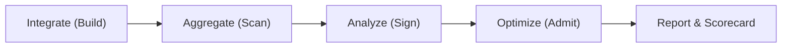

### 3. Distributed Security Topology
Strategically orchestrating standardized security across global container regions, diverse cloud architectures, and multi-cloud targets, providing a unified institutional view of global security health and operational readiness.

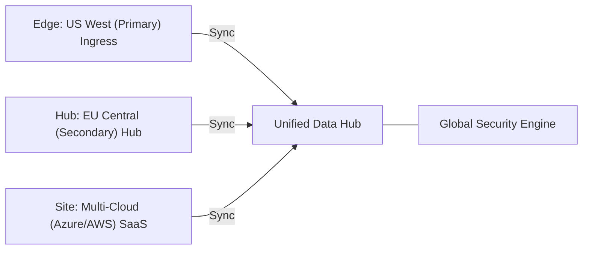

### 4. Security Hub & High-Trust Data Plane Protection Flow
Executing complex logic for securing the bridge between developers and production clusters, ensuring every organizational identity is verified, artifact-level privacy is maintained, and every security access is according to institutional standards.

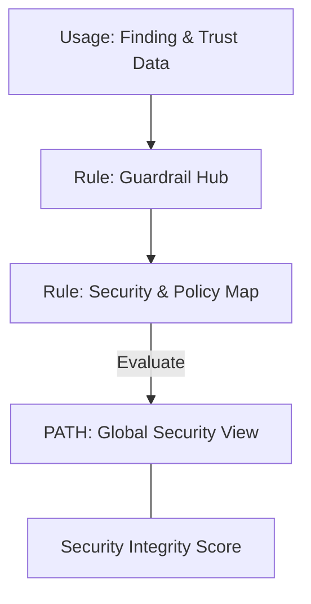

### 5. Multi-Cloud Security Federation & Governance Flow
Automatically managing unified security standards across global regions and diverse cloud tenants, ensuring institutional data residency and privacy boundaries by default.

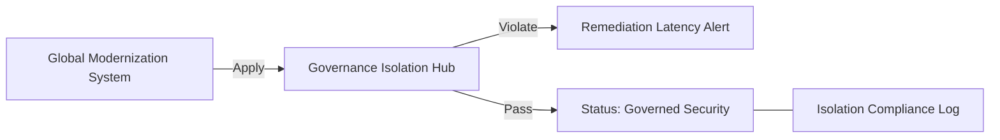

### 6. Encryption & Perimeter Protection Flow (Security Standard)
Managing the lifecycle of a security request, automatically enforcing institutional TLS 1.3 and resource encryption standards as required by security policy, ensuring zero-latency security confidence.

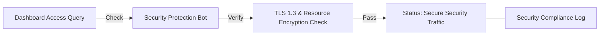

### 7. Institutional Security Maturity Scorecard
Grading organizational performance based on key indicators: Vulnerability Remediation Index, Trust Attestation Index, and Admission Compliance Scores.

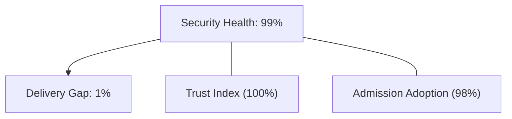

### 8. Identity & RBAC for Security Governance
Managing fine-grained access to security hubs, provisioning workers, and audit logs between CISOs, DevSecOps Leads, and Platform SREs.

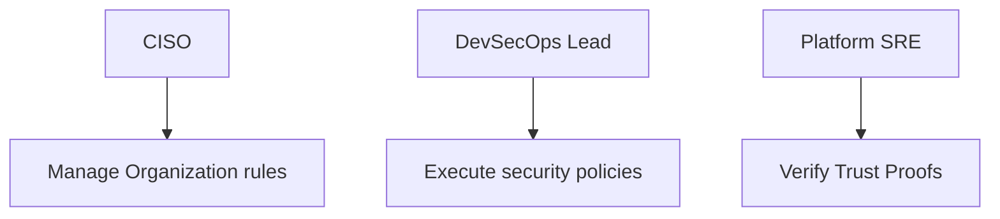

### 9. IaC Deployment: Container-Security-Pipeline-as-Code Framework
Using modular Terraform to deploy and manage the versioned distribution of the security tracking hubs, admission protection workers, and forensic metadata lakes.

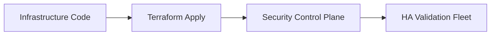

### 10. AIOps Security Drift & Risk Validation Flow
Using advanced analytics to identify sudden surges in vulnerability findings, unauthorized policy changes, suspicious configuration drifts, or unusual delivery pattern changes that could result in institutional risk or compromise.

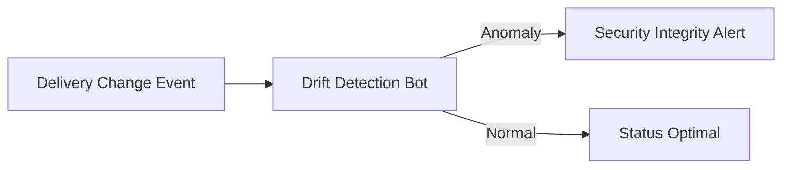

### 11. Metadata Lake for Forensic Security Audit
Storing long-term records of every security integration event (metadata), every admission decision executed, and every signature history for institutional record-keeping, compliance auditing, and post-provisioning forensics.

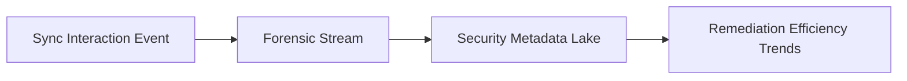

---

## 🏛️ Core Governance Pillars

1.  **Unified Foundation Coordination**: Maximizing resilience by centralizing all security measurement through a single institutional plane.
2.  **Automated Security Provisioning**: Eliminating "manual scanning" scenarios through proactive orchestration and pattern verification.
3.  **Sequential Supply Chain Intelligence**: Ensuring zero-interruption operations through dependency-aware trust-driven data engineering.
4.  **Zero-Trust Identity Protection**: Automatically enforcing identity-based access, data-at-rest encryption, and policy evaluation across all security tiers.
5.  **Autonomous Operations Logic**: Guaranteeing reliability through automated industry-specific effectiveness monitoring runbooks.
6.  **Full Security Auditability**: Immutable recording of every security change and security provision for institutional forensics.

---

## 🛠️ Technical Stack & Implementation

### Security Engine & APIs
*   **Framework**: Python 3.11+ / FastAPI.
*   **Performance Engine**: Custom Python-based logic for multi-toolchain ingestion and DORA-style security metrics.
*   **Integrations**: Native connectors for Trivy, Grype, Cosign, and Kyverno.
*   **Persistence**: PostgreSQL (Security Ledger) and Redis (Live Scan State).
*   **Auth Orchestrator**: Federated OIDC/SAML for least-privilege security management access.

### Governance Dashboard (UI)
*   **Framework**: React 18 / Vite.
*   **Theme**: Dark, Slate, Indigo (Modern high-fidelity productivity aesthetic).
*   **Visualization**: D3.js for delivery topologies and Recharts for remediation velocity analytics.

### Infrastructure & DevOps
*   **Runtime**: AWS EKS or Azure Kubernetes Service (AKS) for management plane.
*   **Measurement Hub**: Managed event sourcing for immutable productivity timeline reconstruction.
*   **IaC**: Modular Terraform for deploying the security landing zone and validation fleet.

---

## 🏗️ IaC Mapping (Module Structure)

| Module | Purpose | Real Services |
| :--- | :--- | :--- |
| **`infrastructure/security_hub`** | Central management plane | EKS, PostgreSQL, Redis |
| **`infrastructure/enforcers`** | Distributed admission provisioners | Azure, AWS, GCP APIs |
| **`infrastructure/security_pipes`** | Data Ingestion Hubs | Webhooks, Lambda |
| **`infrastructure/auditing`** | Forensic modernization sinks | S3, Athena, Quicksight |

---

## 🚀 Deployment Guide

### Local Principal Environment
```bash
# Clone the Container Security Pipeline repository
git clone https://github.com/devopstrio/container-security-pipeline.git
cd container-security-pipeline

# Configure environment
cp .env.example .env

# Launch the Security stack
make init

# Trigger a mock security update and automated guardrail validation simulation
make simulate-security
```

Access the Management Portal at `http://localhost:3000`.

---

## 📜 License
Distributed under the MIT License. See `LICENSE` for more information.

---
<div align="center">
  <p>© 2026 Devopstrio. All rights reserved.</p>
</div>
