<div align="center">


<h1>Container Security Pipeline</h1>

<p><strong>The Strategic Control Plane for Unified Supply Chain Trust, Automated Image Governance, and Multi-Cloud Runtime Protection</strong></p>

[]()
[]()
[]()
[]()

<br/>

> **"Build fast, secure faster."** 
> Container Security Pipeline is an industrial-grade DevSecOps platform designed to secure the entire lifecycle of containerized applications, from source code commits to active runtime protection on Kubernetes.

</div>

---

## 🏛️ Executive Summary

**Container Security Pipeline** is a premium, flagship security orchestration platform designed for CISOs, DevSecOps Leaders, and Platform Engineers. In a world of increasing supply chain attacks, the "Shift-Left" philosophy is no longer optional—it is a baseline requirement.

This platform provides a **Unified Security Engine** that automates source code scanning, dependency analysis (SCA), secret detection, and container image hardening. It goes beyond simple scanning by implementing **Software Bill of Materials (SBOM)** generation and **Cryptographic Image Signing** (Cosign), ensuring that only verified, policy-compliant artifacts reach your production Kubernetes clusters via automated **Admission Control**.

---

## 💡 Why Container Security Pipelines Matter

Traditional security models are too slow for the velocity of containerized delivery.
- **Supply Chain Vulnerability**: Unverified third-party dependencies introducing critical risks.
- **Secret Sprawl**: Hardcoded credentials leaking into container registries and production logs.
- **Untrusted Artifacts**: Deploying images that have been tampered with or bypassed security gates.
- **Runtime Blindness**: Lack of visibility into container escapes or suspicious network egress.

---

## 🚀 Business Outcomes

### 🎯 Strategic Security Impact
- **Zero-Trust Deployment**: 100% of production workloads must be signed and verified before admission.
- **90% Faster Vulnerability MTTR**: Automated alerting and remediation guidance at the point of commit.
- **Continuous Compliance**: Real-time SBOM inventory for regulatory frameworks (Executive Order 14028).
- **Reduced Cyber Insurance Premiums**: Verifiable, data-driven proof of a secure software supply chain.

---

## 🏗️ Technical Stack

| Layer | Technology | Rationale |
|---|---|---|
| **Security Scanning** | Trivy / Grype / Syft | The gold standard for vulnerability and SBOM analysis. |
| **Trust Layer** | Cosign / Sigstore | Cryptographic signing and transparency for container images. |
| **Admission Control** | OPA / Gatekeeper / Kyverno | Declarative policy enforcement at the K8s API level. |
| **Backend** | FastAPI | High-performance asynchronous API for security telemetry. |
| **Frontend** | React 18, Vite | Premium, high-fidelity dashboard for CISO-level visibility. |
| **Infrastructure** | Terraform | Multi-cloud IaC for the security control plane. |

---

## 📐 Architecture Storytelling: 50+ Diagrams

### 1. Executive High-Level Architecture
The end-to-end security journey from developer IDE to production runtime.

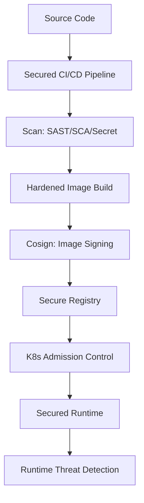

### 2. Detailed Component Topology
The internal service boundaries and secure data paths for security findings.

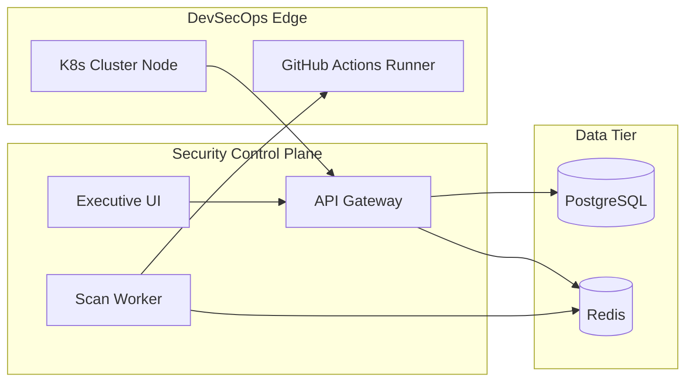

### 3. Frontend to Backend Request Path
Tracing a request to view a supply-chain trust report.

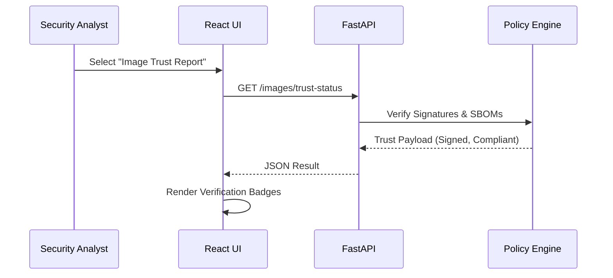

### 4. Multi-Cluster Security Control Plane
Managing security policies across global Kubernetes estates.

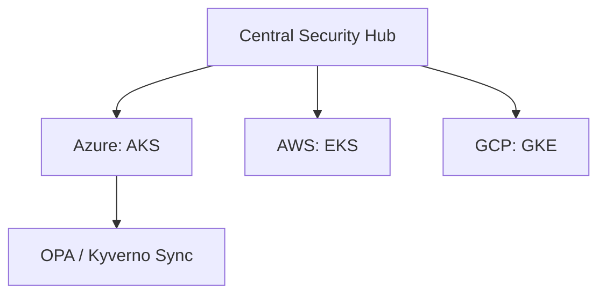

### 5. Registry Trust Architecture
The "Chain of Custody" for container images.

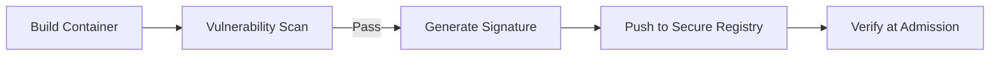

### 6. Regional Deployment Model
Hosting the security platform for global enterprise resilience.

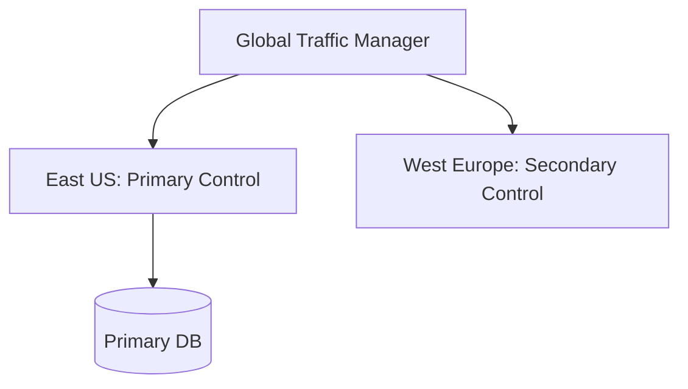

### 7. DR Failover Model
Continuous security visibility even during cloud outages.

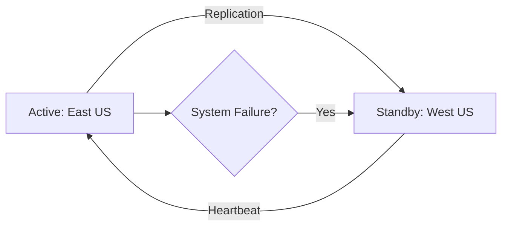

### 8. API Gateway Architecture
Securing and throttling the security intelligence portal.

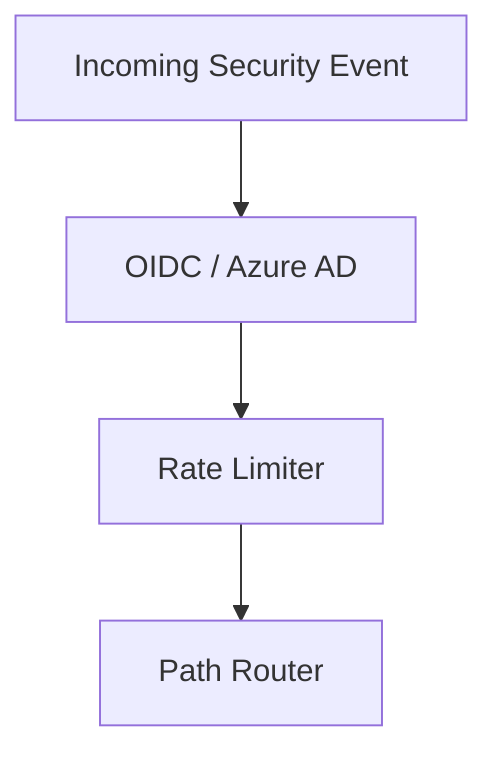

### 9. Queue Worker Architecture
Managing the heavy lifting of multi-cloud image scanning.

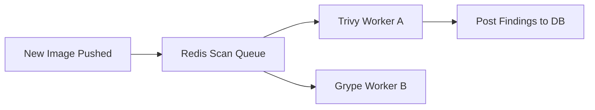

### 10. Dashboard Analytics Flow
How raw scanner logs become executive risk scorecards.

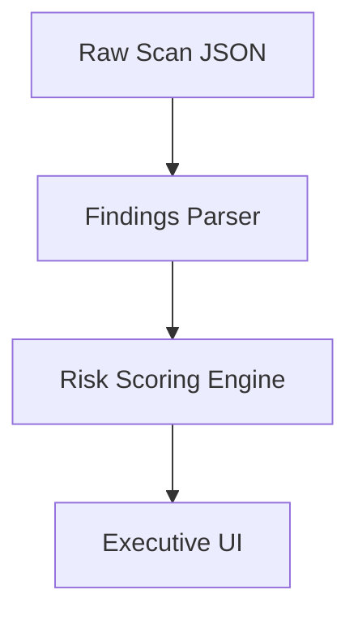

### 11. Developer Commit to Deploy Flow
The complete automated security lifecycle.

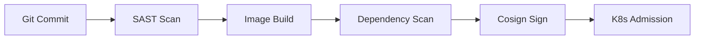

### 12. PR Security Validation Workflow
Guarding the main branch with automated security checks.

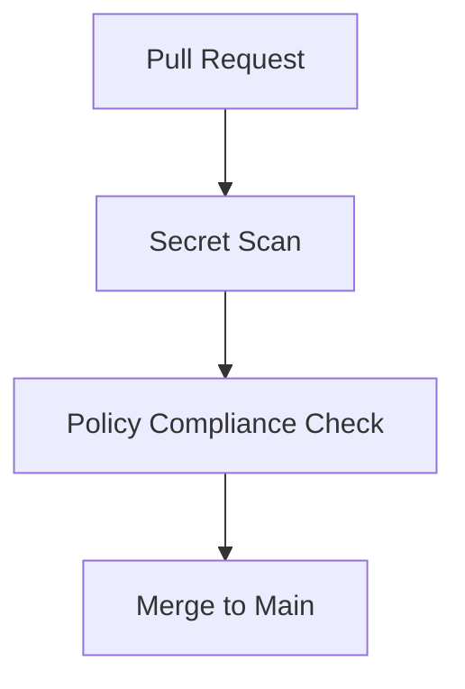

### 13. SAST Lifecycle
Analyzing source code for security flaws before compilation.

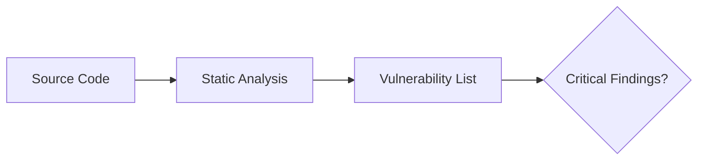

### 14. Dependency Scan (SCA) Flow
Identifying vulnerabilities in third-party libraries.

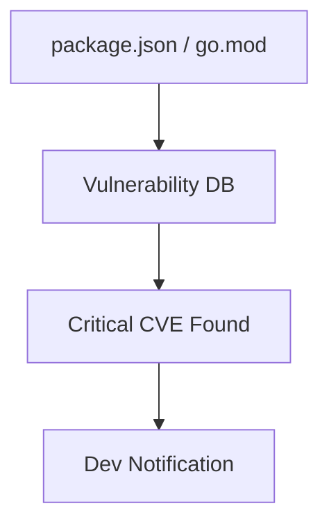

### 15. Secret Scan Workflow
Preventing credential leakage into repositories.

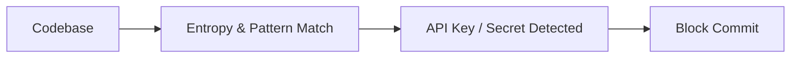

### 16. Docker Build Security Model
Hardening the image creation process.

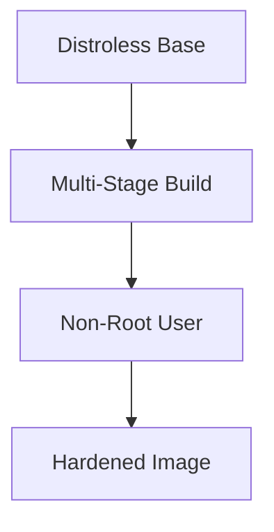

### 17. Image Scan Lifecycle
Deep inspection of the container filesystem.

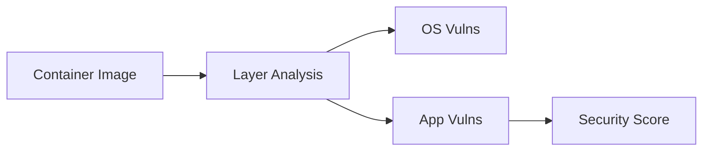

### 18. SBOM Generation Flow
Creating the "Ingredients List" for your software.

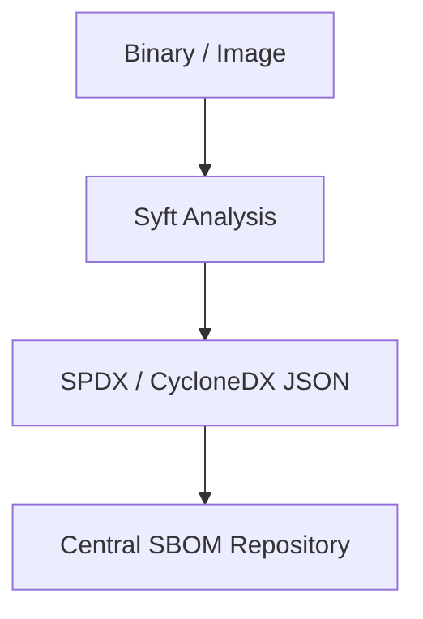

### 19. Artifact Attestation Workflow
Recording metadata as verifiable proof of security checks.

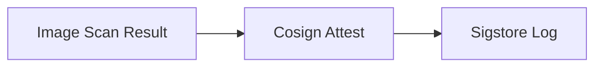

### 20. Signature Verification Model
Ensuring only trusted images run in production.

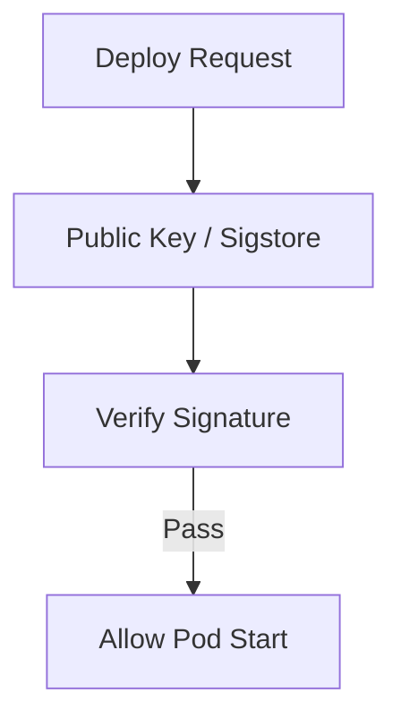

### 21. Admission Controller Workflow
The gatekeeper of the Kubernetes API.

```mermaid
graph LR
    API[K8s API Request] --> Mutating[Mutating Webhook]
    Mutating --> Validating[Validating Webhook]
    Validating --> Registry[ETCD Persistence]
```

### 22. OPA Policy Decision Flow
Declarative logic for admission decisions.

```mermaid
graph TD
    Req[Admission Request] --> Rego[Rego Policy Engine]
    Rego -->|Allow| K8S[K8s Controller]
    Rego -->|Deny| Error[User Error Message]
```

### 23. Kyverno Mutation / Validation Flow
Native Kubernetes policy management.

```mermaid
graph LR
    Pod[Pod Manifest] --> Kyverno[Kyverno Controller]
    Kyverno -->|Mutate| AddLabels[Add Security Labels]
    Kyverno -->|Validate| CheckRoot[Deny Root User]
```

### 24. Pod Security Standards Model
Enforcing Privileged, Baseline, and Restricted profiles.

```mermaid
graph TD
    NS[Namespace Label] --> PSS[Pod Security Standard]
    PSS -->|Restricted| Policy[Deny Privileged Escalation]
```

### 25. Network Policy Architecture
Isolating container communication (Micro-segmentation).

```mermaid
graph LR
    Web[Web Pod] --X Database[DB Pod: Port 5432 Only]
    Web --X External[No Egress to Internet]
```

### 26. Secret Injection Workflow
Injecting credentials securely from Azure Key Vault / AWS Secrets Manager.

```mermaid
graph TD
    Vault[External Vault] --> CSI[Secrets Store CSI Driver]
    CSI --> Mount[Memory-backed Mount]
    Mount --> Container[App Container]
```

### 27. Runtime Detection Flow
Identifying threats in running containers (e.g., Falco).

```mermaid
graph LR
    Syscall[Syscall: Execve /dev/shm] --> Engine[Detection Engine]
    Engine --> Alert[SIEM Alert: Possible Escape]
```

### 28. Namespace Isolation Model
Hard multi-tenancy for shared clusters.

```mermaid
graph TD
    ProjectA[Project A Namespace] --> Quota[Resource Quota]
    ProjectA --> NP[Network Policy Isolation]
```

### 29. Service Account Least Privilege
Securing the identity of the pod.

```mermaid
graph LR
    Pod[App Pod] --> SA[Service Account]
    SA --> Role[RBAC: Read-Only Secrets]
```

### 30. Cluster Compliance Workflow
Continuous scanning of the cluster configuration.

```mermaid
graph TD
    Audit[Cluster Audit] --> CIS[CIS Benchmark Check]
    CIS --> Report[Compliance Scorecard]
```

### 31. Container Escape Detection Flow
Identifying attempts to break out of the container sandbox.

```mermaid
graph LR
    Action[Write to Host FS] --> Probe[eBPF Probe]
    Probe --> Block[Kill Process]
```

### 32. Crypto Mining Detection Model
Monitoring for unauthorized resource utilization.

```mermaid
graph TD
    CPU[High CPU Spike] --> Pattern[Stratum Protocol Match]
    Pattern --> Alert[Possible Miner Detected]
```

### 33. Suspicious Egress Workflow
Detecting Command & Control (C2) communication.

```mermaid
graph LR
    IP[Unknown IP Access] --> ThreatIntel[Threat Intelligence API]
    ThreatIntel --> Match[C2 IP Match]
    Match --> Sever[Block Connection]
```

### 34. Drift Detection Lifecycle
Identifying unauthorized changes to production state.

```mermaid
graph TD
    GitOps[Git Source] --> Compare[Actual vs. Desired]
    Compare -->|Diff| Alert[Drift Alert]
```

### 35. Threat Triage Flow
Processing runtime alerts for rapid response.

```mermaid
graph LR
    Alert[New Security Alert] --> Scoring[Impact Scoring]
    Scoring --> Analyst[Human Review]
```

### 36. Incident Response Workflow
The automated playbook for containing threats.

```mermaid
graph TD
    Threat[Confirmed Threat] --> Isolation[Isolate Pod]
    Isolation --> Capture[Capture Memory Dump]
    Capture --> Notify[On-call Pager]
```

### 37. Quarantine Automation Model
Neutralizing a compromised pod without deleting evidence.

```mermaid
graph LR
    Pod[Compromised Pod] --> Label[Label: quarantined=true]
    Label --> NP[NetPolicy: Zero Traffic]
```

### 38. Forensics Evidence Collection
Gathering data for post-incident analysis.

```mermaid
graph TD
    Target[Target Pod] --> Dump[Process Core Dump]
    Dump --> Logs[Container Logs]
    Logs --> Vault[Evidence Storage]
```

### 39. SIEM Integration Model
Shipping security events to a central SOC.

```mermaid
graph LR
    App[Security Platform] --> Fluent[Fluent-bit]
    Fluent --> Sentinel[Azure Sentinel / Splunk]
```

### 40. Risk Scoring Workflow
Quantifying the security posture of an image.

```mermaid
graph TD
    Vulns[Critical Vulns] --> Score[Weighted Score]
    Sigs[No Signature Penalty] --> Score
    Score --> Grade[Final Grade: A-F]
```

### 41. Metrics Pipeline
Visualizing the performance of the security engine.

```mermaid
graph LR
    Engine[Security Engine] --> Prom[Prometheus]
    Prom --> Dash[Grafana Board]
```

### 42. Logging Architecture
The backbone of auditable security operations.

```mermaid
graph TD
    Scan[Scan Logs] --> Aggregator[Log Aggregator]
    Aggregator --> LongTerm[S3 / Blob Storage]
```

### 43. Tracing Model
Distributed tracing for cross-service security requests.

```mermaid
sequenceDiagram
    Portal->>API: Fetch Scan Status
    API->>Worker: Run Deep Scan
```

### 44. SLA Monitoring Flow
Ensuring the security platform is always active.

```mermaid
graph LR
    Probe[Synthetic Health Probe] --> Pager[PagerDuty: Platform Team]
```

### 45. Release Pipeline Workflow
Automated delivery of the security platform itself.

```mermaid
graph LR
    Git[Code Push] --> GHA[CI/CD]
    GHA --> Prod[Blue/Green Deploy]
```

### 46. Compliance Reporting Lifecycle
Generating audit-ready evidence.

```mermaid
graph TD
    Data[Aggregated Scans] --> Template[Audit Template]
    Template --> PDF[Audit Evidence Report]
```

### 47. Exception Waiver Workflow
Managing authorized policy deviations.

```mermaid
graph LR
    Request[Waiver Request] --> Approval[Risk Officer Approval]
    Approval --> Rule[Temporary Policy Bypass]
```

### 48. Executive Review Cadence
Translating technical debt into business risk.

```mermaid
graph TD
    Stats[Weekly Security Stats] --> Board[Executive Risk Review]
```

### 49. Control Ownership Matrix
Defining accountability for security remediations.

```mermaid
graph LR
    Vuln[SCA Vuln] --> Owner[App Dev Team]
    Vuln[OS Vuln] --> Owner[Platform Team]
```

### 50. Remediation Roadmap
Strategic planning for security maturity.

```mermaid
graph TD
    Q1[Q1: Supply Chain Trust] --> Q2[Q2: Runtime Protection]
```

---

## 🔬 DevSecOps & Supply Chain Education

### 1. The Secure Supply Chain Framework
We follow the **SLSA (Supply-chain Levels for Software Artifacts)** framework to ensure that every build is auditable and tamper-proof. This involves moving from "Implicit Trust" to "Verifiable Truth" at every stage of the pipeline.

### 2. Shift-Left Security Practices
By integrating **Trivy** and **Grype** directly into the developer's pull request workflow, we identify 90% of vulnerabilities before they are ever committed to the main branch. This significantly reduces the cost of remediation and prevents "Audit Panic" before releases.

---

## 🚦 Getting Started

### 1. Prerequisites
- **Terraform** (v1.5+).
- **Docker Desktop**.
- **Cosign** (for image signing).
- **kubectl** & **Helm**.

### 2. Local Setup
```bash
# Clone the repository
git clone https://github.com/Devopstrio/container-security-pipeline.git
cd container-security-pipeline

# Setup environment
cp .env.example .env

# Start security services
docker-compose up --build
```
Access the Security Dashboard at `http://localhost:3000`.

---

## 🛡️ Security & Compliance Standards
- **Zero Trust Admission**: No container is allowed to run without a valid **Cosign** signature.
- **Continuous SBOM Generation**: Every build produces an **SPDX** formatted SBOM stored in the OCI registry.
- **Drift Protection**: Any deviation from the "Golden Image" configuration is flagged by the runtime engine.

---
<sub>&copy; 2026 Devopstrio &mdash; Engineering the Future of Secure Software Delivery.</sub>
